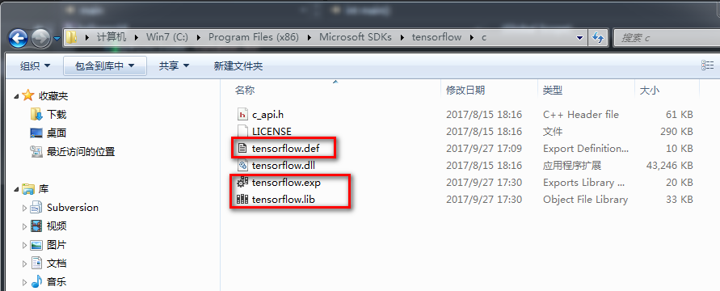
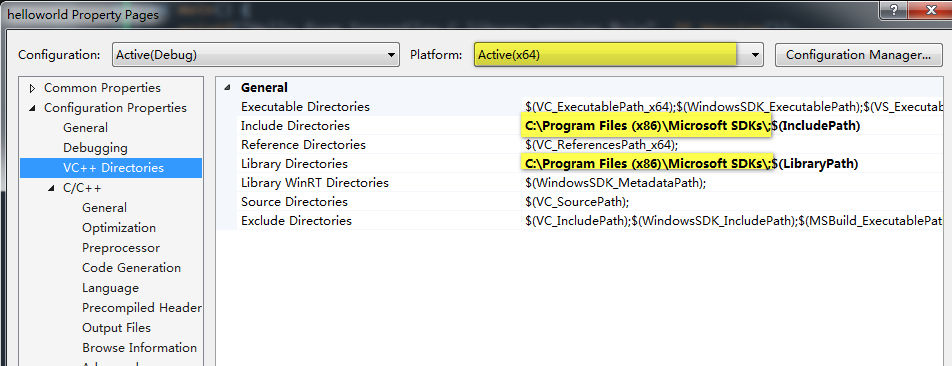
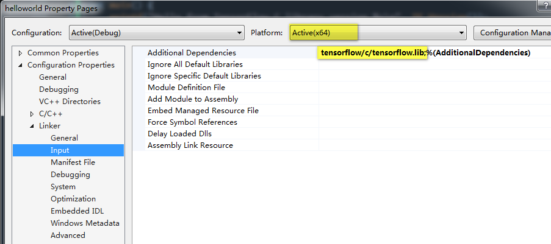

## 安装

参考：https://www.tensorflow.org/install/install_c

官网提供的方法是用一个脚本去安装：
```
TF_TYPE="cpu" # Change to "gpu" for GPU support
OS="linux" # Change to "darwin" for Mac OS
TARGET_DIRECTORY="/usr/local"
curl -L \
   "https://storage.googleapis.com/tensorflow/libtensorflow/libtensorflow-${TF_TYPE}-${OS}-x86_64-1.3.0.tar.gz" |
   sudo tar -C $TARGET_DIRECTORY -xz
```

由于`https://storage.googleapis.com`被墙，若没有系统级的翻墙软件，则需要先用浏览器翻墙，将其下载回来。当然，你若想安装其他版本，打开`https://storage.googleapis.com/tensorflow/`，选择你想要的版本安装。下面的示例只是windows x64 cpu和linux x64 cpu两个安装示例。

**windows x64 cpu版本**

下载该文件:
```
https://storage.googleapis.com/tensorflow/libtensorflow/libtensorflow-cpu-windows-x86_64-1.3.0.zip
```
下载得到一个压缩包，里面只有三个文件，解压到指定的目录，比如我的是：
```
C:\Program Files (x86)\Microsoft SDKs\tensorflow\c
```
没有tensorflow.lib文件怎么办，难道总是显式调用tensorflow?

别急，参考[由动态库文件dll生成lib库文件](http://blog.csdn.net/giselite/article/details/32098169)一文，我们可以通过tensorflow.dll生成tensorflow.lib文件（不是指静态库）。



你可以在本仓库中的`01 Windows和Linux安装Tensorflow/tensorflow-cpu-1.3-exp-lib`下载现成的文件


**linux x64 cpu版本**

下载该文件:
```
https://storage.googleapis.com/tensorflow/libtensorflow/libtensorflow-cpu-linux-x86_64-1.3.0.tar.gz
```
解压到/usr/local目录:
```
sudo tar -C /usr/local -zxf libtensorflow-cpu-linux-x86_64-1.3.0.tar.gz
```

## 验证

按照惯例，hello world不可或缺。新建一个`helloworld.c`文件:
```
#include <stdio.h>
#include <tensorflow/c/c_api.h>

int main() {
  printf("Hello from TensorFlow C library version %s\n", TF_Version());
  return 0;
}
```

**windows下编译**

新建一个vs工程，将helloworld.c添加到工程，配置如下：



注意，因为只有x64的dll，因此只能编译x64的版本。


**Linux下编译**

```
ybt@ubuntu:~/Code/C/tensorflow$ gcc helloworld.c -o helloworld -ltensorflow
ybt@ubuntu:~/Code/C/tensorflow$ export LD_LIBRARY_PATH=/usr/local/lib/
ybt@ubuntu:~/Code/C/tensorflow$ ./helloworld 
Hello from TensorFlow C library version 1.3.0
```